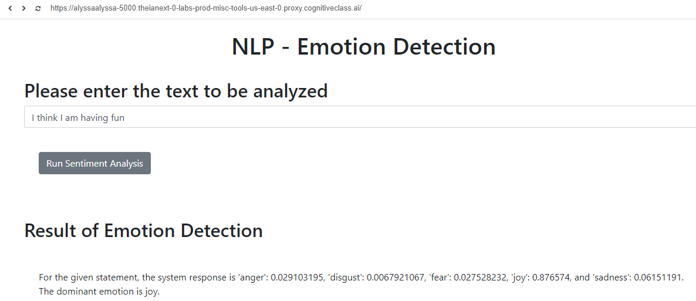
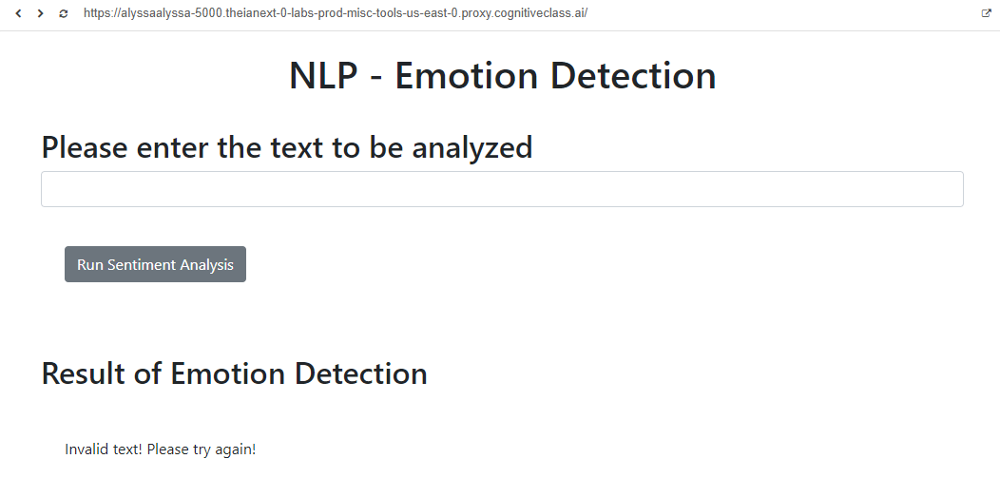

# Emotion Detector API Website

This repository contains the files necessary to run Watson's emotion detector API through a web interface. By inputting a message into the website, the API detects how much anger, disgust, fear, joy, and sadness is in it.

## Installation
This is made to be used in a Linux terminal. Before cloning this repository, please make sure that you have the following programs and Python libraries installed in your terminal:
- Git
- Python 3.11 or higher
- Flask 2.2.2 or higher
- render_template
- request
- json

If there is anything that you are missing, you should be able to install them with the `pip install` command, followed by their names.

To install this emotion detector API interface onto your terminal, simply clone this repository in your current directory: `git clone https://github.com/alyssarose05/emotion-website.git`

## Running the server
To run the server and work with the web-based API, use your version of Python to run the `server.py` file. For example, for Python 3.11, you would do `python3.11 server.py`. This will make the Flask server start running at port 5000. 
You will need to launch the application under the 5000 port. This is commonly done by typing `127.0.0.1:5000` in your web browser.

## Using the server
The Watson emotion API measures the emotions that are in a message by giving a score depending on how relevant they each are to the message. The emotion with the highest score is the dominant emotion. 

Here is an example with the message "I think I am having fun"

Note that if you put in a blank response, a response will not be generated. You will have to try again.

## Terminating the server
To terminate the server at any time, you should be able to press CTRL+C to close the server.

