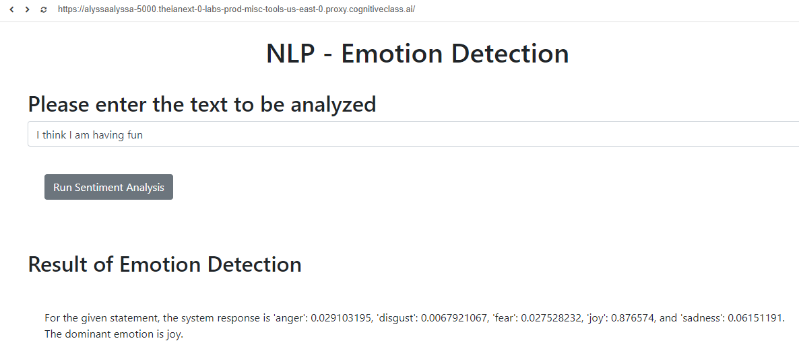
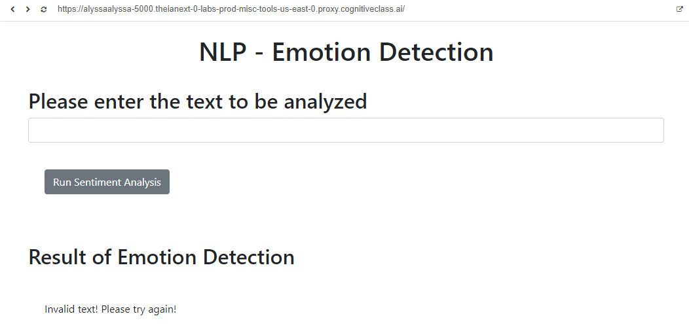

# emotion-detection
A web-based tool that uses Watson's EmotionPredict API to detect different emotions contained in text.

## Installation
This project requires `Python 3.11` or higher, and `Flask 2.2.2` or higher to run the code. The following libraries can then be installed with `pip install`:
- `render_template`
- `requests`
- `json`
- Optional: `unittest` (for test cases)

## Server usage

### Startup
In this directory, use your installed Python version to run the `server.py` file. Then launch the application under the `5000` port. This is commonly done by typing `127.0.0.1:5000` in your web browser.

### Usage
The API measures the emotions that you type into the textbox with different percentages. The emotion with the highest percentage is the dominant emotion. 

Here is an example with the message `I think I am having fun`:

Note that if the textbox is blank, a response will not be generated. 

### Termination
To close the server, press `CTRL+C` or your equivalent command in the terminal.

## Credits
- This project uses Watson's EmotionPredict API as referenced by IBM: https://www.ibm.com/docs/en/watson-libraries?topic=catalog-emotion
- The materials for this project were used from IBM's Applied Software Engineering fundamentals: https://www.coursera.org/specializations/software-engineering-fundamentals
